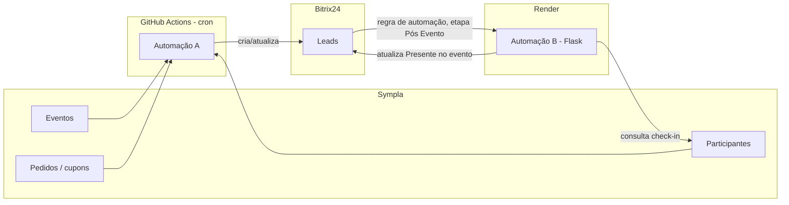

# automacao-crm-sympla

Duas automações que ligam a Sympla ao Bitrix24, pra sincronizar inscrições em eventos com o CRM e depois confirmar presença.

- **Automação A** (`automacao_a_inscricoes.py`): roda periodicamente via GitHub Actions, busca eventos próximos na Sympla, casa cada inscrito com um Lead do Bitrix (ou cria um novo) e preenche os dados do evento.
- **Automação B** (`automacao_b_presenca.py`): um serviço web (Flask, hospedado no Render) que o Bitrix chama depois do evento, pra descobrir se aquele Lead marcou check-in na Sympla e atualizar o campo "Presente no evento".

## Como os dados fluem



A Automação A é quem faz a inscrição virar Lead. A Automação B só entra em ação quando o próprio Bitrix chama ela (configurado como uma regra de automação na etapa "Pós Evento" do funil), pra fechar o ciclo com a presença.

## Os arquivos

| Arquivo | O que faz |
|---|---|
| `common.py` | Tudo que as duas automações compartilham: chamadas às APIs da Sympla e do Bitrix, normalização de telefone/e-mail/nome, resolução de cupom. |
| `automacao_a_inscricoes.py` | A automação principal, roda no GitHub Actions a cada poucos minutos. |
| `automacao_b_presenca.py` | O serviço Flask que confirma presença, roda no Render. |
| `setup_custom_fields.py` | Script de setup: garante que os campos customizados e o estágio de Lead que as automações precisam existem no Bitrix. Roda uma vez, ou de novo quando algo muda. |
| `preview_novos_leads.py` | Mostra o que a Automação A faria em cada inscrito, sem escrever nada no Bitrix. Bom pra validar antes de confiar numa mudança. |
| `relatorio_participantes.py` | Script pontual pra gerar um CSV com todos os participantes de todos os eventos, cruzando com o Bitrix. Não faz parte do ciclo normal das automações. |
| `.github/workflows/automacao_a.yml` | Agenda a Automação A no GitHub Actions. |
| `render.yaml` | Blueprint do Render pra subir a Automação B. |

Detalhes de como cada peça funciona por dentro (formato dos dados da Sympla, lógica de matching, cache, peculiaridades da API do Bitrix) estão em [`docs/ARQUITETURA.md`](docs/ARQUITETURA.md). Passo a passo de operação do dia a dia (adicionar assessor, testar com segurança, resolver erro comum) está em [`docs/OPERACAO.md`](docs/OPERACAO.md).

## Rodando local

```bash
python3 -m venv .venv
source .venv/bin/activate
pip install -r requirements.txt

cp .env.example .env
# preenche o .env com os valores reais (token Sympla, webhook Bitrix, códigos de campo)

python setup_custom_fields.py   # garante que os campos/estágio existem no Bitrix
python preview_novos_leads.py   # mostra o que aconteceria, sem escrever nada
python automacao_a_inscricoes.py  # roda de verdade
```

Pra testar a Automação B localmente:

```bash
flask --app automacao_b_presenca run --port 5001
curl -X POST http://localhost:5001/webhook/pos-evento -d "lead_id=256"
```

## Deploy

**Automação A** roda no GitHub Actions (`.github/workflows/automacao_a.yml`), agendada por cron. Precisa desses secrets configurados no repositório (Settings → Secrets and variables → Actions):

- `SYMPLA_TOKEN`
- `BITRIX_WEBHOOK_URL`
- `BITRIX_STAGE_INSCRITO_PRO_EVENTO`
- `BITRIX_FIELD_DATA_DO_EVENTO`
- `BITRIX_FIELD_NOME_DO_EVENTO`
- `BITRIX_FIELD_SYMPLA_EVENT_ID`
- `BITRIX_FIELD_ORIGEM`

O workflow usa o cache do próprio GitHub Actions pra lembrar quem já foi processado entre uma execução e outra, então não reprocessa os mesmos inscritos toda vez.

**Automação B** roda no Render como um serviço web free (`render.yaml`), com essas env vars:

- `SYMPLA_TOKEN`
- `BITRIX_WEBHOOK_URL`
- `BITRIX_FIELD_SYMPLA_EVENT_ID`
- `BITRIX_FIELD_PRESENTE_NO_EVENTO`

O plano free do Render dorme depois de um tempo sem tráfego, então tem um serviço externo (cron-job.org ou similar) batendo no endpoint `/health` a cada 10 minutos pra manter ela acordada.

O webhook de entrada do Bitrix precisa das permissões `CRM (crm)` e `Usuários (user)` (essa segunda é usada pra descobrir o ID do assessor responsável a partir do e-mail).
